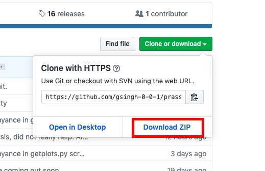

# PRASSE - PulsaR Automated Search Script Ensemble

Written by Gurmehar Singh - gurmehar@gmail.com. Please contact me if you have any questions or would like to contribute!
This is a work in progress, and more contributors are always better.

The purpose of this repository is to take FFT plots and sort through them automatically
without relying on humans. The tests were run on a 2015 MacBook Pro - see specs below:

Processor: 2.7 GHz Intel Core i5

Memory: 8 GB 1867 MHz DDR3 

Keep these in mind when looking at runtime statistics.


# Instructions (Steps 1-2 need only be completed once)

### 1. Installing Anaconda

To start working on the code it's required that you have a python environment. If you already have a Python environment set up, skip to step 4.

To install anaconda visit https://www.anaconda.com/distribution/#download-section and download the package installer for your operating system
 

### 2. Using the Terminal (Skip this step if you are already familiar with the terminal)

#### Opening terminal
- The terminal app is located in the Utilities folder in applications. To open it, either double click to run the terminal app from within the utilities folder, or press Command-Space, type out "Terminal", and double click on the first result.
- Once the terminal is open, you will see a small white window with black text on it.
#### Changing Directories 
- A directory is a folder within your computer. When you change directories you are changing the folder that you are in.
- To enter a directory, type ```cd``` followed by the pathname. For example, if you want to enter the directory with a path of /user/Downloads/ the command would be ```cd /user/Downloads/```.
- To check your current directory use the command ```pwd```.
- To return to your home directory simply type ```cd``` by itself.
#### Listing the Files in a Directory
- To list the files in the directory that you currently are in, use the command ```ls```.
#### Keyboard Interruption
- To end any processes or programs that are running in the terminal simply use the keys "Ctrl+c".
#### Closing Terminal
- To close the terminal, first end any running processes using "Ctrl+c" and then click the red x icon in the top left corner of the terminal window.


### 3. Getting the Code to Run
#### Downloading the Code
- To get started with the code, you must first clone it from the GitHub repository. To clone the latest version of the code, you can either open Terminal and run the command ```git clone https://github.com/gsingh-0-0-1/prasse foldername``` (Where "foldername" is the name of the new folder that you want the code to be in), or you can visit the repository in your browser and simply click the green "Clone or Download" button. 
- If you download the code via your browser, then the zip file will be found on your Downloads folder. In order access the code you must unzip the file. If you downloaded the code through the terminal, then the code will be found in the folder that you chose.

#### Getting the Plots
- To run the code, you must first run the setup.py file. To do this, simply open terminal and do ```python setup.py```
- Running the file will create four folders and will install all of the required dependencies. 
- To download the plots to analyze, run the command  ```python getplots.py [start dataset] [number of datasets] [directory to download to] [fft/singlepulse]``` Where "start dataset" is the dataset number you want to start with, "number of datasets" is the amount of datasets you want to download after the start dataset, "directory to download to" is the directory to download the plots to (the default is "images"), and "fft/singlepulse" allows you to specify what type of plots you want to download. When you execute the command in the terminal, since the file gets the plots straight from the Pulsar Search Collaboratory Database, you have to input your Pulsar Search Collaboratory username and password when the terminal prompts you.
- Alternatively, you can always download the testing datasets at https://tinyurl.com/pulsartestdatasets

#### Running the Code
- To analyze the plots that you downloaded from the Pulsar Search Collaboratory, run the command ```python phasesub_stacking_alg.py reg default nogui```. 
- For plots that are not from the Pulsar Search Collaboratory use the command ```python phasesub_stacking_alg.py inp default nogui```. The program will then prompt you to enter the coordinates of the plot.
- The default algorithm does well overall with PSC datasets. If you want to filter for RFI, you can only use plots from the PSC database as plots from other places might be formatted differently.
  - So far the default algorithm has a true positive rate of 100% which means that so far, it has detected all of the pulsars that were fed into it. Its false positive rate is roughly around 2.5%, which is based on experimentally derived statistics consisting of tests of nearly 100,000 individual pieces of data. However, this statistic depends heavily on how much radio frequency interference appears in the data, which can sometimes slip through the filter. As of the last edit of this file, the average runtime of the program is 10-11 plots per second, depending on how frequently the program validates the DM of the possible pulsar candidates.
- If you want to tinker with the efficiency of the algorithm, the full command is 
```python phasesub_stacking_alg.py [crop option] spike_thresh spike_rel_mean_dist noise_thresh noise_rel_mean_distance override obj_min nogui```.
  - ```crop option:``` This option controls how the program crops out the phase-subband graphs. Use “reg” for data from the GBT, and “inp” for other data. If you use this option, make sure to first check the coordinates in the image of the phase-subband graphs - do this after resizing the image to 780 by 582. The program will automatically resize the images to this size, but you’ll have to tell the program where to crop out the image.
  - ```spike_thresh:``` This option controls the threshold for finding peaks in the data. A higher number means that fewer points will be flagged as a spike or a pulse.
  - ```spike_rel_median_dist:``` This controls how spike_thresh is applied. A larger number tends to stabilize this set of values to a straight line.
  - ```noise_thresh:``` This is the threshold for something to be considered a horizontal line, and flagged as a noise point. A higher number means that fewer points will be flagged as noise.
  - ```noise_rel_mean_distance:``` This serves the same purpose for noise_thresh as the spike_rel_mean_dist serves for spike_thresh
  - ```override:``` This number is sort of a “veto” - if there are any points detected above this threshold, the plot will instantly be dumped into the pulsar folder. It’s not reliant on any values obtained from the image, which makes it a useful tool.
  - ```obj_min:``` This works as the opposite of the override parameter.
  - For more detailed descriptions, please contact me.


And remember, this is still in production, so there may be glitches and misclassifications! Contact me if you have a suggestion
I didn’t include here or a bug I missed.

Huge thanks to Martin Nikolov (marvic2409) for helping troubleshoot the software and providing a ton of extra data, as well as programming most of the web integration for 
this software - coming soon.

Credits to Vibha for providing the known pulsars dataset.
